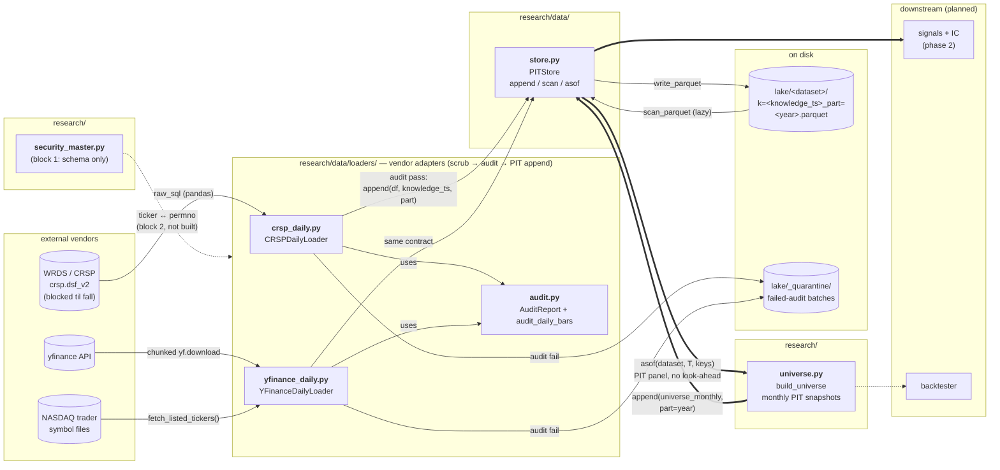
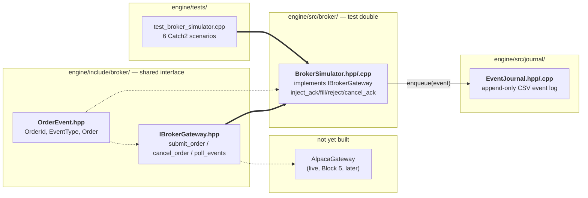
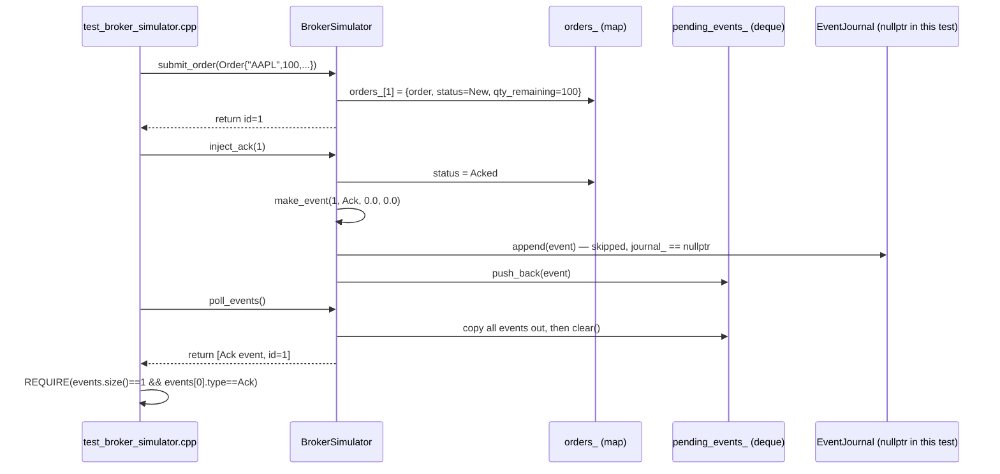
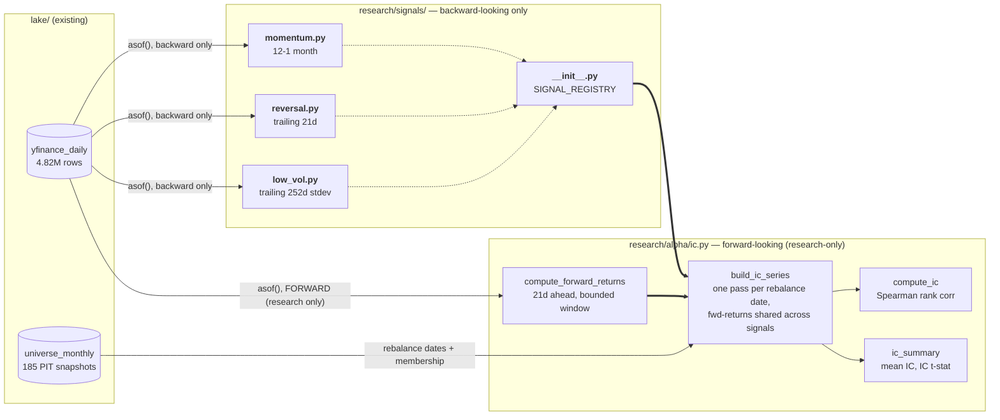
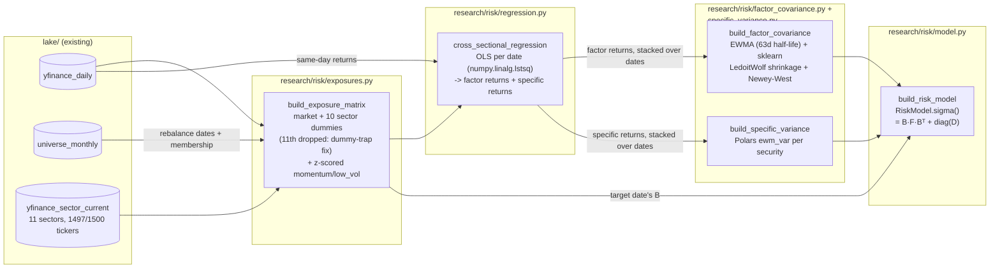

# System Map

> Living diagram of every system, file, and function in the repo. **Update rule: every time a file is added, removed, or gains/loses a public function, this map is updated in the same session.** Requested by Ethan 2026-07-13.

Legend:
- **solid box / bold** — built + tested
- *dashed box / italic* — approved spec, not yet built
- `dotted / plain` — designed in DESIGN.md, not yet specced

## Data layer (Phase 1 — current)

Data flows left → right: vendor → loader (scrub/audit) → PITStore → parquet lake. Research reads flow back out **only** through `asof()` — that single exit is what makes look-ahead bias structurally impossible.

## C++ engine (Block 5 — broker simulator skeleton, started 2026-07-16)

Order gateway state machine, position keeper, pre-trade risk checks, and market data handler (the rest of Block 5) are separate, not yet scoped. Building this jumped ahead of DESIGN.md's build-phasing order (C++ engine is step 7, after signals/risk/optimizer/backtester) as a deliberate design/scope exercise — the phasing order for the *remaining* build queue is unchanged.

**How a test actually drives it** (e.g. `test_broker_simulator.cpp`'s "submit then ack" case):

Key thing this shows: `submit_order` never touches the queue — nothing "happens" until a test calls `inject_*`. And `enqueue()` always tries the journal *before* the queue, so a crash between "event journaled" and "caller saw it via poll_events()" is exactly the gap crash-recovery replay is built to close (not yet implemented — journal here is just an append-only CSV write).

## Signals + alpha (Block 2 — Phase 2, started 2026-07-16)

Real run over the full 2011-2026 lake (`python -m research.alpha.ic --start 2011 --end 2026`): momentum n=169 mean_ic=0.019 t=1.45, reversal n=180 mean_ic=0.0007 t=0.07, low_vol n=174 mean_ic=-0.0017 t=-0.10, 824.2s total — recorded in docs/METRICS.md. `n` differs per signal because each needs a different amount of trailing history before producing its first value (reversal 22d, low-vol 252d, momentum 273d).

## Risk model (Block 3 — full Barra-style scope, built 2026-07-19)

Real run (`build_risk_model(store, "2026-07-14", lookback_years=3)`): 985 securities, 13 factors, 179.5s, shrinkage=0.302, Σ symmetric + explicitly confirmed finite — recorded in docs/METRICS.md. Two real bugs found+fixed against the real lake (null sector value crashing `sorted()`; null `ret` becoming NaN via `.to_numpy()` and corrupting `lstsq`), plus one red herring ruled out (spurious Apple Accelerate BLAS warnings, confirmed benign, documented in `RiskModel.sigma()`'s docstring) — full chain in docs/METRICS.md.

**Known simplification**: a different reference sector can be dropped on different dates (whichever is alphabetically first among sectors present that day), so the factor-column set can vary date to date. `build_factor_return_history` handles this by keeping only dates where the full common factor set is present (drop-incomplete, never fabricate) — see `research/risk/model.py`'s module docstring.

## Files & functions

### research/data/store.py — **built** (5 tests)
Bitemporal (point-in-time) parquet store. Two time axes: `effective_date` (when true in market, caller supplies) × `knowledge_ts` (when we learned it, store stamps).

| function | does |
|---|---|
| `PITStore.__init__(root)` | binds store to a lake directory |
| `_dataset_dir(dataset)` | root/dataset path helper |
| `append(dataset, df, knowledge_ts, part=None)` | validates schema (`effective_date` required as pl.Date; stamp columns forbidden), stamps `knowledge_ts`+`load_ts`, writes one parquet batch named by knowledge_ts (+part). Idempotent: re-run overwrites same file |
| `scan(dataset)` | lazy scan of all batches, **no** PIT filter — debug/inspection only |
| `asof(dataset, knowledge_ts, keys)` | the world as known at T: drop rows learned after T, keep latest known revision per (keys, effective_date). The only research read path |

### research/data/loaders/crsp_daily.py — **built** (6 tests; live pull blocked until fall)
CRSP daily bars via WRDS, CIZ format (`crsp.dsf_v2`). Delisting returns arrive inside `dlyret` — no separate merge.

| function | does |
|---|---|
| `CRSPDailyLoader.verify_schema()` | asserts expected CIZ columns exist on live table before any pull (columns unverified until first real connection) |
| `load_year(year, knowledge_ts)` | pull one calendar year (common-stock SQL filter) → transform → audit → append on pass / quarantine on fail |
| `_transform(pdf)` | pandas→Polars, vendor→internal names (permno→security_id), derives `dollar_volume`, `market_cap` |
| `_audit(df, year)` | thin wrapper over shared `audit_daily_bars` (null cols: close, ret, volume, shrout) |
| `_quarantine(df, year, ts)` | failed batch → lake/_quarantine/, never enters PIT data |
| `main(argv)` | CLI: `python -m research.data.loaders.crsp_daily --start 2011` — per-year reports, rows/s for METRICS.md |

### research/data/loaders/audit.py — **built (part 2b, shared by all loaders)**
| symbol | does |
|---|---|
| `AuditReport` | per-chunk result: rows, days, null counts, outliers, fetch_failures, failures, `ok` |
| `audit_daily_bars(df, year, null_cols, ...)` | hard-fail: empty chunk, dup (security_id, effective_date), bad trading-day count for past years; nulls + \|ret\|>200% + vendor fetch failures counted, never dropped |

### research/data/loaders/yfinance_daily.py — **built (part 2b; interim vendor while WRDS blocked)**
Dataset `yfinance_daily` keyed by ticker; never merged with `crsp_daily` (security master, part 4). Survivorship-biased, no delisting returns — replaced wholesale by CRSP in fall.

| function | does |
|---|---|
| `YFinanceClient` | real adapter: chunked `yf.download` (auto_adjust=False: raw Close for dollar_volume, Adj Close for returns), `fast_info["shares"]`; paced (`pause_s` between chunks) + exponential backoff on Yahoo throttle (60s doubling, `max_retries`, then chunk skipped into fetch_failures) |
| `_rate_limited_errors(errors)` | detects Yahoo throttle in `yfinance.shared._ERRORS` (batch download swallows YFRateLimitError instead of raising); delisted-ticker errors never match |
| `YFinanceDailyLoader.load_year(year, tickers, knowledge_ts, chunk_size)` | chunked pull → transform → shared audit → append `part=year` / quarantine; failed chunks + missing tickers → `fetch_failures` (flagged, not fatal) |
| `_transform(frames)` | wide→long stack; drops all-null grid artifacts (pre-IPO dates); `ret` = Adj Close pct_change per ticker (first bar/year null, counted); dollar_volume from raw close |
| `load_shares_current(tickers, ts)` | one-row-per-ticker snapshot → own dataset `yfinance_shares_current`, effective_date = fetch date (current-only value; per-bar storage would embed look-ahead) |
| `YFinanceClient.sector_info(ticker)` | (sector, industry) via yfinance `.info` (Yahoo's own taxonomy, not literal GICS) — heavier/more rate-limited than `fast_info`, paced by `pause_s` per call |
| `load_sector_current(tickers, ts)` | one-row-per-ticker snapshot → own dataset `yfinance_sector_current`, mirrors `load_shares_current` exactly (current-only, same look-ahead reasoning). Factor-exposure input for the Block 3 risk model |
| `fetch_listed_tickers()` | NASDAQ Trader symbol files → filter test issues/ETFs/'$'-preferreds, map `.`→`-` (BRK.B→BRK-B) |
| `select_liquid_tickers(store, top_n, year)` | fetch triage for two-phase backfill: top-N by median daily dollar volume in one year (median: spike days don't buy slots). NOT the part-3 universe |
| `read_tickers_file(path)` | one ticker/line, blanks + # comments skipped (feeds `--tickers-file`) |
| `main(argv)` | CLI: `python -m research.data.loaders.yfinance_daily --start 2011` (+`--pause/--max-retries/--backoff` pacing, `--no-threads` sequential drip, `--tickers-file`, `--select-top N --select-year Y` ranking mode, `--shares`) — per-year reports, rows/s for METRICS.md |

### research/universe.py — **built (part 3, 9 tests)**
Monthly PIT universe: dataset `universe_monthly`, one snapshot per month-end trading day, rows = (effective_date, security_id, rank, median_dollar_volume, last_close, days_traded). Market-cap filter deferred to CRSP (no shares data in yfinance bars).

| function | does |
|---|---|
| `month_end_trading_days(bars)` | last observed trading date per calendar month — rebuild dates come from the data, no calendar lib |
| `build_snapshot(bars, rebuild_date, top_n, adv_window, min_price, min_days)` | one month's membership: trailing `adv_window` trading days, per-security median dollar_volume / last raw close / days traded; filters coverage ≥ min_days, close > min_price; rank + cut top_n. Short trailing history → empty (no noise universes) |
| `build_universe(store, start_year, end_year, ..., knowledge_ts)` | asof-read bars at knowledge cutoff (default now), one `build_snapshot` per month-end in range, concat |
| `main(argv)` | CLI: `python -m research.universe --start 2011 --top 1000 --window 60 --min-price 5` — writes `universe_monthly` part per year (idempotent), per-year + done lines for METRICS.md |

### research/security_master.py — **built (part 4, blocks 1-3 of 4; 14 tests)**
Fixes the identity mismatch between `crsp_daily.security_id` (permno) and `yfinance_daily`/`universe_monthly.security_id` (ticker): a permanent `internal_id` spine mapped to date-ranged external identifiers. No CRSP hookup yet (block 4).

| symbol | does |
|---|---|
| `SCHEMA` | `effective_date` (=valid_from, store's required column, repurposed like universe.py), `internal_id` (UInt32 spine), `id_type` (free string — "ticker" today, "permno"/"cusip" later), `id_value`, `valid_to` (null = current), `source` |
| `empty_master()` | zero-row frame matching `SCHEMA`, mirrors `universe.py`'s `_empty_snapshot()` pattern |
| `_ticker_segments(bars, gap_days)` | one row per (ticker, contiguous trading run); a >`gap_days`-calendar-day hole between consecutive trading dates starts a new segment — heuristic proxy for symbol reassignment, NOT a real corporate-actions feed (can't tell "reused ticker" from "long vendor data gap" — confirmed against real data, see METRICS.md) |
| `build_ticker_segments(bars, gap_days=90, source=...)` | segments → `SCHEMA`-shaped frame; `internal_id` assigned deterministically by sorting on (valid_from, ticker) so reruns reproduce the same IDs; `valid_to=null` only for the segment reaching the lake's most recent date |
| `main(argv)` | CLI: `python -m research.security_master --lake lake --gap-days 90` — writes `security_master` (single batch, no year-partitioning — it's an identity table, not a timeseries), reports segment/reuse counts for METRICS.md |
| `resolve_securities(store, id_values, as_of, id_type, knowledge_ts)` | vectorized panel lookup: internal_id for a whole list of identifiers as of one shared date, one query (house rule: no Python loops over stocks). Unresolvable identifiers are simply absent from the output |
| `resolve_security(store, id_value, as_of, ...)` | scalar convenience wrapping `resolve_securities` with one identifier — tests/debugging, not production panel code |

Dataset `security_master` writes/reads through the exact same `store.append`/`store.asof` calls as every other dataset — no new storage mechanism. Proven in tests: ticker reuse (two `internal_id`s sharing one `id_value` over disjoint date ranges) resolves to the correct one via a plain `effective_date`/`valid_to` filter after `asof()`.

### research/signals/ — **built (Phase 2, 7 tests)**
Every signal follows one contract: `fn(bars: pl.LazyFrame, rebuild_date: date) -> pl.DataFrame[effective_date, security_id, signal_value]`. Only looks backward from `rebuild_date` — the PIT boundary this whole project enforces. Scope is momentum/reversal/low-vol only; value/quality/size need fundamentals not yet ingested (data fact, not a preference).

| file / symbol | does |
|---|---|
| `momentum.py` — `compute_momentum(bars, rebuild_date, lookback_days=252, skip_days=21)` | 12-1 month momentum: cumulative log-return from 252 trading days ago to 21 days ago (skip-month excludes reversal contamination). Per-security cumsum + lagged diff, vectorized |
| `reversal.py` — `compute_reversal(bars, rebuild_date, window_days=21)` | trailing 21-day cumulative return, RAW (not sign-flipped) — reversal theory predicts negative IC; the signal reports the empirical value and lets IC measurement reveal the sign |
| `low_vol.py` — `compute_low_vol(bars, rebuild_date, window_days=252)` | trailing 252-day stdev of daily `ret`, RAW (same no-sign-flip convention). Uses `universe.py`'s window-of-dates technique, not momentum's cumsum-diff |
| `__init__.py` — `SIGNAL_REGISTRY` | `{"momentum": compute_momentum, "reversal": compute_reversal, "low_vol": compute_low_vol}` — add a 4th signal by writing the file + one registry line, nothing else changes |

### research/alpha/ic.py — **built (Phase 2, 8 tests)**
IC = rank correlation of a signal vs. the forward return it's trying to predict (DESIGN.md Block 2). Rebalance dates + membership come from `lake/universe_monthly`, point-in-time.

| function | does |
|---|---|
| `compute_forward_returns(bars, rebuild_date, horizon_days=21)` | forward 21-trading-day return per security, from `rebuild_date`. Deliberately reads AHEAD in time — never call from signal/decision code. Bounded to a forward date-window (same technique as `low_vol`) — computing over full history measured at 3.3s/call vs 1.2s bounded (docs/METRICS.md) |
| `compute_ic(signal_df, forward_returns_df)` | Spearman rank correlation between joined signal value and forward return; `None` (not 0) if fewer than 2 securities have both |
| `build_ic_series(store, signal_fns, start_year, end_year, horizon_days=21)` | one IC value per rebalance date, per signal in `signal_fns` (typically the whole `SIGNAL_REGISTRY`) — forward returns computed ONCE per date and shared across every signal, not recomputed per signal (fixed a 3x redundant-computation bug same session) |
| `ic_summary(ic_series)` → `IcSummary` | mean IC, IC std, IC t-stat — is the edge statistically real or noise |
| `main(argv)` | CLI: `python -m research.alpha.ic --start 2011 --end 2026` — per-signal IC summary + total wall time, for METRICS.md |

### research/risk/ — **built (Block 3, full Barra-style scope, 17 tests)**
First numpy-matrix module in the repo (everything before this is Polars-only). Real-lake verified: 985 securities, 13 factors, 179.5s — see docs/METRICS.md for the 2-bug-plus-1-red-herring debugging chain that got it there.

| file / symbol | does |
|---|---|
| `exposures.py` — `build_exposure_matrix(bars, sectors, rebuild_date, members)` | B per date: market (constant 1.0), sector dummies (11th dropped — dummy-trap fix), z-scored momentum/low_vol. Filters null sector values (real bug: 3 tickers unresolved by yfinance crashed `sorted()` before this fix) |
| `regression.py` — `cross_sectional_regression(returns, exposures)` | OLS per date via `numpy.linalg.lstsq`; coefficients = factor returns, residuals = specific returns. Filters null `ret` (real bug: the loader's known first-bar-of-year null flowed into `.to_numpy()` as NaN and corrupted every downstream matmul before this fix) |
| `factor_covariance.py` — `build_factor_covariance(factor_return_history, halflife_days=63)` | EWMA-weighted (via a row-rescaling trick, since sklearn's `LedoitWolf` has no native sample-weight support) + Ledoit-Wolf shrunk + Newey-West (Bartlett kernel lagged autocovariance) → F |
| `specific_variance.py` — `build_specific_variance(specific_return_history, halflife_days=63)` | Polars native `ewm_var(half_life=...)` per security → D |
| `model.py` — `RiskModel` (dataclass, `.sigma()`), `build_factor_return_history`, `build_risk_model` | orchestrates all of the above into Σ = B·F·Bᵀ + diag(D) for one date, using trailing history for F/D. `RiskModel.sigma()`'s docstring documents the benign Apple Accelerate BLAS warning quirk found here |

### engine/ — **built (broker simulator skeleton, 6 Catch2 tests)**
First C++ in the repo. CMake + Catch2 v3.9.1, C++20. Requires Homebrew LLVM on this dev machine (`-DCMAKE_CXX_COMPILER=/opt/homebrew/opt/llvm/bin/clang++`) — system AppleClang/CommandLineTools libc++ headers are broken.

| file / symbol | does |
|---|---|
| `include/broker/OrderEvent.hpp` — `OrderId`, `EventType`, `to_string(EventType)`, `OrderEvent` | shared event type (id, type, qty, price, ts, reason) emitted by any gateway implementation into the same journal |
| `include/broker/IBrokerGateway.hpp` — `Order`, `IBrokerGateway` | abstract interface (`submit_order`/`cancel_order`/`poll_events`) implemented by both `BrokerSimulator` (now) and the future live `AlpacaGateway` |
| `src/broker/BrokerSimulator.hpp/.cpp` — `BrokerSimulator` | mock broker: `submit_order` only registers the order; nothing happens until a test calls `inject_ack`/`inject_fill`/`inject_reject`/`inject_cancel_ack`; every injected event appended to the journal (if set) then queued for `poll_events()` |
| `src/journal/EventJournal.hpp/.cpp` — `EventJournal` | append-only CSV log of every `OrderEvent`, flushed synchronously; skeleton only — binary framing + replay-on-restart parser scoped when the order gateway is built |
| `tests/test_broker_simulator.cpp` | 6 Catch2 scenarios: ack, out-of-order fill-before-ack, partial-then-full fill, reject-with-reason, poll drains the queue, cancel on unknown id throws |
| `CMakeLists.txt` (root + tests/) | Catch2 pinned via FetchContent (v3.9.1); `build/` gitignored |

### Barrel files
- `research/data/__init__.py` — exports `PITStore`
- `research/data/loaders/__init__.py` — exports `CRSPDailyLoader`, `YFinanceDailyLoader`, `AuditReport`, `audit_daily_bars`

### tests/ — **79 passing (Python)** + **6 passing (C++, `ctest --test-dir engine/build`)**
| file | covers |
|---|---|
| `test_store.py` | round trip, PIT asof windows (before/mid/after revision), idempotent append, part coexist+overwrite+path-safety, schema rejection |
| `test_crsp_loader.py` | happy path into store, re-run idempotency, dup quarantine, short-past-year audit fail, nulls/outliers flagged not dropped, schema verify (offline FakeConn) |
| `test_universe.py` | month-end date derivation, median-not-mean ranking + top-N cut + rank column, $5 filter on raw close, coverage filter (sparse ticker out), short-history empty guard, knowledge-cutoff hides later loads, one snapshot per month, CLI writes dataset, empty-lake exit 1 |
| `test_security_master.py` | empty-frame schema match, round trip through store, store's own effective_date validation still applies, reused-ticker date-ranged resolution (two internal_ids, one id_value, disjoint valid ranges, correct one picked per as-of date incl. the unassigned gap), gap-based segment splitting, no-gap stays one segment, internal_id ordered by valid_from, CLI writes dataset + reports reuse count, panel resolution incl. gap/unresolvable/current cases, scalar wrapper matches panel |
| `test_yfinance_loader.py` | happy path (ret from Adj Close, dollar_volume from raw close), idempotency, grid-artifact drop vs partial-null keep, fetch failures flagged not fatal, failed chunk skipped, dup quarantine, short-past-year fail, shares snapshot, sector/industry snapshot (incl. unresolved ticker -> null), symbol-file parsing (offline FakeClient); throttle detector + backoff schedule + give-up + legit-partial-no-retry (monkeypatched yf.download, fake sleep); volume dtype pinned to Float64 regardless of source int/float split |
| `test_signals.py` | momentum/reversal closed-form match for constant returns, low-vol zero for constant returns, short-history empty guard (all 3), momentum ignores data after rebuild_date (look-ahead safety), registry contains all 3 |
| `test_ic.py` | forward-return closed-form match, empty when insufficient future data, IC perfect positive/negative correlation, IC None below 2 joined rows, build_ic_series restricts to universe membership (and shares forward-returns across signals), ic_summary basic + null-handling + empty |
| `test_exposures.py` | shape + sector dummy correctness, missing-sector exclusion, null-sector-value exclusion (real bug regression test), empty on insufficient history |
| `test_regression.py` | zero-noise exact-coefficient recovery, drops securities missing from either side, null-ret exclusion (real bug regression test), underdetermined → empty |
| `test_factor_covariance.py` | shape/symmetry/shrinkage bounds, correlated factors show higher covariance than uncorrelated, short half-life weights recent data more than a long one (all deterministic, no random-statistical tolerances) |
| `test_specific_variance.py` | constant returns → zero variance, varying returns → positive variance, single-observation exclusion, empty input |
| `test_risk_model.py` | end-to-end shape/symmetry/positive-diagonal against a real PITStore, None on insufficient history |
| `engine/tests/test_broker_simulator.cpp` | ack, out-of-order fill-before-ack, partial-then-full fill, reject-with-reason, poll drains the queue, cancel-on-unknown-id throws |

### Config
- `pyproject.toml` — deps: polars ≥1.42, wrds ≥3.2, yfinance ≥1.5, numpy ≥2.0, scikit-learn ≥1.5; pytest config

## Not yet started (DESIGN.md blocks)
security master block 4 (CRSP permno/CUSIP hookup) · `research/portfolio/` (Block 4 Optimizer, next in phasing order) · `research/attribution/` · backtester · `engine/` remaining Block 5 pieces (order gateway state machine, position keeper, pre-trade risk checks, market data handler, live `AlpacaGateway`) · `common/` · `infra/`
