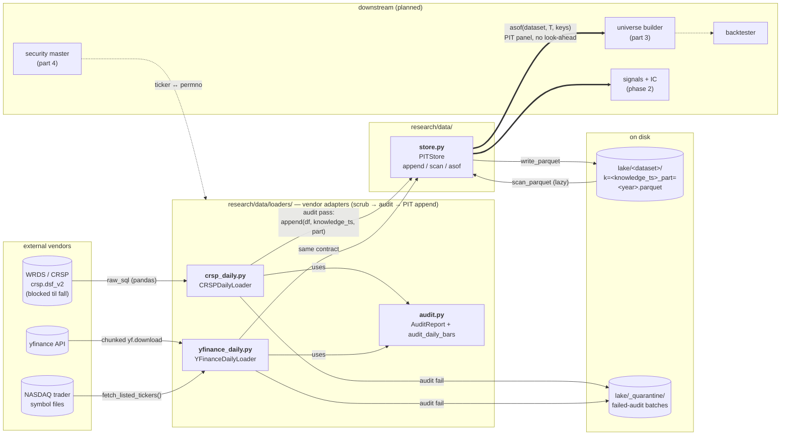

# System Map

> Living diagram of every system, file, and function in the repo. **Update rule: every time a file is added, removed, or gains/loses a public function, this map is updated in the same session.** Requested by Ethan 2026-07-13.

Legend:
- **solid box / bold** — built + tested
- *dashed box / italic* — approved spec, not yet built
- `dotted / plain` — designed in DESIGN.md, not yet specced

## Data layer (Phase 1 — current)

Data flows left → right: vendor → loader (scrub/audit) → PITStore → parquet lake. Research reads flow back out **only** through `asof()` — that single exit is what makes look-ahead bias structurally impossible.

## Files & functions

### research/data/store.py — **built** (5 tests)
Bitemporal (point-in-time) parquet store. Two time axes: `effective_date` (when true in market, caller supplies) × `knowledge_ts` (when we learned it, store stamps).

| function | does |
|---|---|
| `PITStore.__init__(root)` | binds store to a lake directory |
| `_dataset_dir(dataset)` | root/dataset path helper |
| `append(dataset, df, knowledge_ts, part=None)` | validates schema (`effective_date` required as pl.Date; stamp columns forbidden), stamps `knowledge_ts`+`load_ts`, writes one parquet batch named by knowledge_ts (+part). Idempotent: re-run overwrites same file |
| `scan(dataset)` | lazy scan of all batches, **no** PIT filter — debug/inspection only |
| `asof(dataset, knowledge_ts, keys)` | the world as known at T: drop rows learned after T, keep latest known revision per (keys, effective_date). The only research read path |

### research/data/loaders/crsp_daily.py — **built** (6 tests; live pull blocked until fall)
CRSP daily bars via WRDS, CIZ format (`crsp.dsf_v2`). Delisting returns arrive inside `dlyret` — no separate merge.

| function | does |
|---|---|
| `CRSPDailyLoader.verify_schema()` | asserts expected CIZ columns exist on live table before any pull (columns unverified until first real connection) |
| `load_year(year, knowledge_ts)` | pull one calendar year (common-stock SQL filter) → transform → audit → append on pass / quarantine on fail |
| `_transform(pdf)` | pandas→Polars, vendor→internal names (permno→security_id), derives `dollar_volume`, `market_cap` |
| `_audit(df, year)` | thin wrapper over shared `audit_daily_bars` (null cols: close, ret, volume, shrout) |
| `_quarantine(df, year, ts)` | failed batch → lake/_quarantine/, never enters PIT data |
| `main(argv)` | CLI: `python -m research.data.loaders.crsp_daily --start 2011` — per-year reports, rows/s for METRICS.md |

### research/data/loaders/audit.py — **built (part 2b, shared by all loaders)**
| symbol | does |
|---|---|
| `AuditReport` | per-chunk result: rows, days, null counts, outliers, fetch_failures, failures, `ok` |
| `audit_daily_bars(df, year, null_cols, ...)` | hard-fail: empty chunk, dup (security_id, effective_date), bad trading-day count for past years; nulls + \|ret\|>200% + vendor fetch failures counted, never dropped |

### research/data/loaders/yfinance_daily.py — **built (part 2b; interim vendor while WRDS blocked)**
Dataset `yfinance_daily` keyed by ticker; never merged with `crsp_daily` (security master, part 4). Survivorship-biased, no delisting returns — replaced wholesale by CRSP in fall.

| function | does |
|---|---|
| `YFinanceClient` | real adapter: chunked `yf.download` (auto_adjust=False: raw Close for dollar_volume, Adj Close for returns), `fast_info["shares"]` |
| `YFinanceDailyLoader.load_year(year, tickers, knowledge_ts, chunk_size)` | chunked pull → transform → shared audit → append `part=year` / quarantine; failed chunks + missing tickers → `fetch_failures` (flagged, not fatal) |
| `_transform(frames)` | wide→long stack; drops all-null grid artifacts (pre-IPO dates); `ret` = Adj Close pct_change per ticker (first bar/year null, counted); dollar_volume from raw close |
| `load_shares_current(tickers, ts)` | one-row-per-ticker snapshot → own dataset `yfinance_shares_current`, effective_date = fetch date (current-only value; per-bar storage would embed look-ahead) |
| `fetch_listed_tickers()` | NASDAQ Trader symbol files → filter test issues/ETFs/'$'-preferreds, map `.`→`-` (BRK.B→BRK-B) |
| `main(argv)` | CLI: `python -m research.data.loaders.yfinance_daily --start 2011` (+`--shares` optional slow snapshot) — per-year reports, rows/s for METRICS.md |

### Barrel files
- `research/data/__init__.py` — exports `PITStore`
- `research/data/loaders/__init__.py` — exports `CRSPDailyLoader`, `YFinanceDailyLoader`, `AuditReport`, `audit_daily_bars`

### tests/ — **20 passing**
| file | covers |
|---|---|
| `test_store.py` | round trip, PIT asof windows (before/mid/after revision), idempotent append, part coexist+overwrite+path-safety, schema rejection |
| `test_crsp_loader.py` | happy path into store, re-run idempotency, dup quarantine, short-past-year audit fail, nulls/outliers flagged not dropped, schema verify (offline FakeConn) |
| `test_yfinance_loader.py` | happy path (ret from Adj Close, dollar_volume from raw close), idempotency, grid-artifact drop vs partial-null keep, fetch failures flagged not fatal, failed chunk skipped, dup quarantine, short-past-year fail, shares snapshot, symbol-file parsing (offline FakeClient) |

### Config
- `pyproject.toml` — deps: polars ≥1.42, wrds ≥3.2, yfinance ≥1.5; pytest config

## Not yet started (DESIGN.md blocks)
`research/signals/` · `research/alpha/` · `research/risk/` · `research/portfolio/` · `research/attribution/` · backtester · `engine/` (C++) · `common/` · `infra/`
