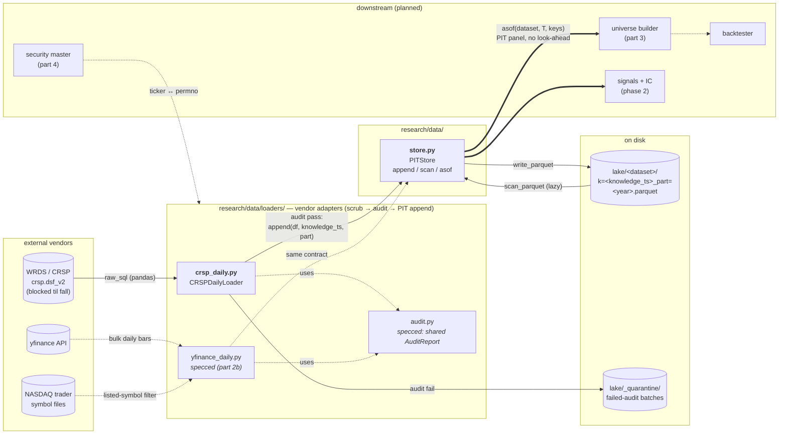

# System Map

> Living diagram of every system, file, and function in the repo. **Update rule: every time a file is added, removed, or gains/loses a public function, this map is updated in the same session.** Requested by Ethan 2026-07-13.

Legend:
- **solid box / bold** — built + tested
- *dashed box / italic* — approved spec, not yet built
- `dotted / plain` — designed in DESIGN.md, not yet specced

## Data layer (Phase 1 — current)

Data flows left → right: vendor → loader (scrub/audit) → PITStore → parquet lake. Research reads flow back out **only** through `asof()` — that single exit is what makes look-ahead bias structurally impossible.

## Files & functions

### research/data/store.py — **built** (5 tests)
Bitemporal (point-in-time) parquet store. Two time axes: `effective_date` (when true in market, caller supplies) × `knowledge_ts` (when we learned it, store stamps).

| function | does |
|---|---|
| `PITStore.__init__(root)` | binds store to a lake directory |
| `_dataset_dir(dataset)` | root/dataset path helper |
| `append(dataset, df, knowledge_ts, part=None)` | validates schema (`effective_date` required as pl.Date; stamp columns forbidden), stamps `knowledge_ts`+`load_ts`, writes one parquet batch named by knowledge_ts (+part). Idempotent: re-run overwrites same file |
| `scan(dataset)` | lazy scan of all batches, **no** PIT filter — debug/inspection only |
| `asof(dataset, knowledge_ts, keys)` | the world as known at T: drop rows learned after T, keep latest known revision per (keys, effective_date). The only research read path |

### research/data/loaders/crsp_daily.py — **built** (6 tests; live pull blocked until fall)
CRSP daily bars via WRDS, CIZ format (`crsp.dsf_v2`). Delisting returns arrive inside `dlyret` — no separate merge.

| function | does |
|---|---|
| `CRSPDailyLoader.verify_schema()` | asserts expected CIZ columns exist on live table before any pull (columns unverified until first real connection) |
| `load_year(year, knowledge_ts)` | pull one calendar year (common-stock SQL filter) → transform → audit → append on pass / quarantine on fail |
| `_transform(pdf)` | pandas→Polars, vendor→internal names (permno→security_id), derives `dollar_volume`, `market_cap` |
| `_audit(df, year)` | dup (security_id, effective_date) = hard fail; trading-day bounds for past years; nulls + \|ret\|>200% counted, never dropped |
| `_quarantine(df, year, ts)` | failed batch → lake/_quarantine/, never enters PIT data |
| `main(argv)` | CLI: `python -m research.data.loaders.crsp_daily --start 2011` — per-year reports, rows/s for METRICS.md |
| `AuditReport` | per-chunk result: rows, days, null counts, outliers, failures, `ok` |

### research/data/loaders/yfinance_daily.py — *approved spec, not built (part 2b)*
Interim free vendor while WRDS is blocked; same contract, separate `yfinance_daily` dataset keyed by ticker. Planned: NASDAQ symbol-file universe fetch, chunked `yf.download`, fetch-failure audit, CLI. Backfill 2011→today, daily bars.

### research/data/loaders/audit.py — *approved spec, not built (part 2b)*
`AuditReport` + generic checks extracted from crsp_daily.py, shared by all loaders.

### Barrel files
- `research/data/__init__.py` — exports `PITStore`
- `research/data/loaders/__init__.py` — exports `CRSPDailyLoader`

### tests/ — **11 passing**
| file | covers |
|---|---|
| `test_store.py` | round trip, PIT asof windows (before/mid/after revision), idempotent append, part coexist+overwrite+path-safety, schema rejection |
| `test_crsp_loader.py` | happy path into store, re-run idempotency, dup quarantine, short-past-year audit fail, nulls/outliers flagged not dropped, schema verify (offline FakeConn) |

### Config
- `pyproject.toml` — deps: polars ≥1.42, wrds ≥3.2 (yfinance pending part 2b); pytest config

## Not yet started (DESIGN.md blocks)
`research/signals/` · `research/alpha/` · `research/risk/` · `research/portfolio/` · `research/attribution/` · backtester · `engine/` (C++) · `common/` · `infra/`
